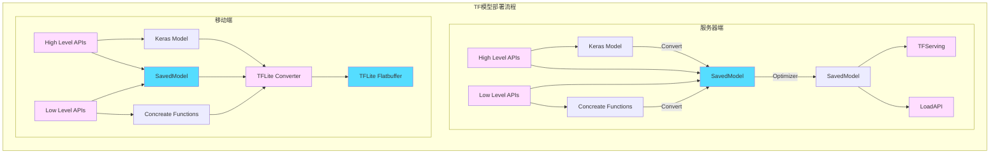
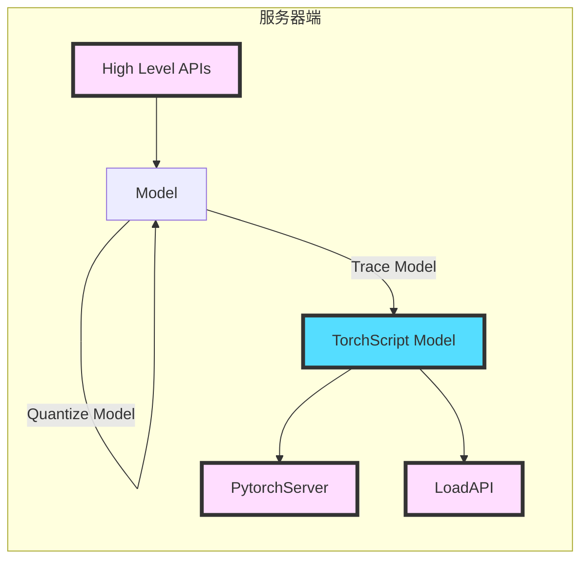
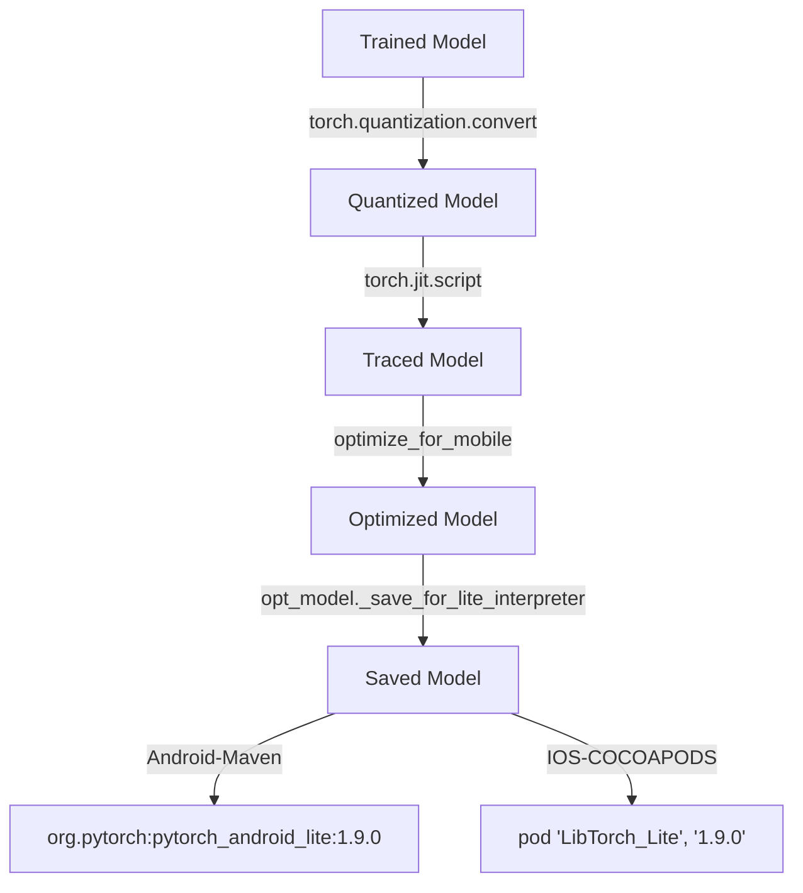
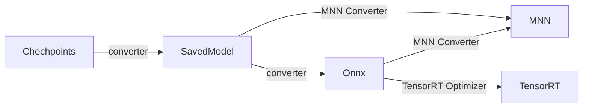
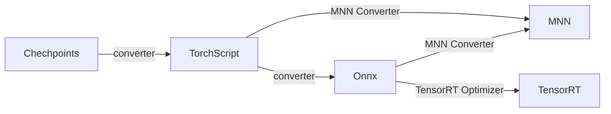
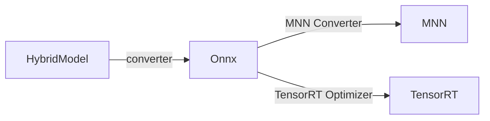

# 模型表示及加速推理

## 1. 模型表示

### 1.1 tensorflow模型表示

#### 1.1.1 Tensorflow模型格式

tensorflow模型保存可以采用checkpoint、hdf5及SavedModel。用于推理场景的推荐采用SavedModel格式，其结构如下：

```
assets/
assets.extra/
variables/
    variables.data-?????-of-?????
    variables.index
saved_model.pb
```

*   SavedModel protocol buffer
    *   [`saved_model.pb`](https://github.com/tensorflow/tensorflow/blob/master/tensorflow/core/protobuf/saved_model.proto) or `saved_model.pbtxt`
    
    *   其包含整个图的定义
    
        ```protobuf
        message SavedModel {
          // The schema version of the SavedModel instance. Used for versioning when
          // making future changes to the specification/implementation. Initial value
          // at release kkkwill be 1.
          int64 saved_model_schema_version = 1;
        
          // One or more MetaGraphs.
          repeated MetaGraphDef meta_graphs = 2;
        }
        ```
    
        *MetaGraphDef* 定义请查考[meta_graph.proto](https://github.com/tensorflow/tensorflow/blob/master/tensorflow/core/protobuf/meta_graph.proto).
    
*   Assets
    
    *   `assets`包含词汇表等辅助文件.
    
*   Extra assets
    *   更高级别的库或者用户可以和模型存储的辅助文件到`assets.extra`，但是该文件夹中的内容不会加载到计算图中.
    *   SavedModel库不会管理目录`assets.extra`.
    
*   Variables
    
    *   参数权重，包含了所有模型的变量(tf.Variable objects)参数
    *    包含如下子文件
        *   `variables.data-?????-of-?????`
        *   `variables.index`


#### 1.1.2 Tensorflow模型定义

##### **Constants**

**(TF1) Tag constants**

tf预定义了一系列tags，用于唯一区别一个SavedModel格式保存的模型结构MetaGraphDef。

```c++
#ifndef TENSORFLOW_CC_SAVED_MODEL_TAG_CONSTANTS_H_
#define TENSORFLOW_CC_SAVED_MODEL_TAG_CONSTANTS_H_

namespace tensorflow {

/// Tag for the `gpu` graph.
constexpr char kSavedModelTagGpu[] = "gpu";

/// Tag for the `tpu` graph.
constexpr char kSavedModelTagTpu[] = "tpu";

/// Tag for the `serving` graph.
constexpr char kSavedModelTagServe[] = "serve";

/// Tag for the `training` graph.
constexpr char kSavedModelTagTrain[] = "train";

}  // namespace tensorflow

#endif  // TENSORFLOW_CC_SAVED_MODEL_TAG_CONSTANTS_H_
```


**(TF1) Signature constants**

SignatureDefs主要定义graph中某一计算过程的签名。比如input keys、output keys和method names：

```c++
#ifndef TENSORFLOW_CC_SAVED_MODEL_SIGNATURE_CONSTANTS_H_
#define TENSORFLOW_CC_SAVED_MODEL_SIGNATURE_CONSTANTS_H_

namespace tensorflow {

/// Key in the signature def map for `default` serving signatures. The default
/// signature is used in inference requests where a specific signature was not
/// specified.
static constexpr char kDefaultServingSignatureDefKey[] = "serving_default";

////////////////////////////////////////////////////////////////////////////////
/// Classification API constants.

/// Classification inputs.
static constexpr char kClassifyInputs[] = "inputs";

/// Classification method name used in a SignatureDef.
static constexpr char kClassifyMethodName[] = "tensorflow/serving/classify";

/// Classification classes output.
static constexpr char kClassifyOutputClasses[] = "classes";

/// Classification scores output.
static constexpr char kClassifyOutputScores[] = "scores";

////////////////////////////////////////////////////////////////////////////////
/// Predict API constants.
/// Predict inputs.
static constexpr char kPredictInputs[] = "inputs";

/// Predict method name used in a SignatureDef.
static constexpr char kPredictMethodName[] = "tensorflow/serving/predict";

/// Predict outputs.
static constexpr char kPredictOutputs[] = "outputs";

////////////////////////////////////////////////////////////////////////////////
/// Regression API constants.

/// Regression inputs.
static constexpr char kRegressInputs[] = "inputs";

/// Regression method name used in a SignatureDef.
static constexpr char kRegressMethodName[] = "tensorflow/serving/regress";

/// Regression outputs.
static constexpr char kRegressOutputs[] = "outputs";
}  // namespace tensorflow

#endif  // TENSORFLOW_CC_SAVED_MODEL_SIGNATURE_CONSTANTS_H_
```


##### **MetaGrahDef**

```protobuf
message MetaGraphDef {
  // Meta information regarding the graph to be exported.  To be used by users
  // of this protocol buffer to encode information regarding their meta graph.
  message MetaInfoDef {
  	...
  }
  MetaInfoDef meta_info_def = 1;
  // GraphDef.
  GraphDef graph_def = 2;
  // SaverDef.
  SaverDef saver_def = 3;
  // collection_def: Map from collection name to collections.
  // See CollectionDef section for details.
  map<string, CollectionDef> collection_def = 4;
  // signature_def: Map from user supplied key for a signature to a single
  // SignatureDef.
  map<string, SignatureDef> signature_def = 5;
  // Asset file def to be used with the defined graph.
  repeated AssetFileDef asset_file_def = 6;
  // Extra information about the structure of functions and stateful objects.
  SavedObjectGraph object_graph_def = 7;
}
```


##### **GraphDef**

```protobuf
// Represents the graph of operations
message GraphDef {
  repeated NodeDef node = 1;

  // Compatibility versions of the graph.  See core/public/version.h for version
  // history.  The GraphDef version is distinct from the TensorFlow version, and
  // each release of TensorFlow will support a range of GraphDef versions.
  VersionDef versions = 4;

  // Deprecated single version field; use versions above instead.  Since all
  // GraphDef changes before "versions" was introduced were forward
  // compatible, this field is entirely ignored.
  ...
  // Function call semantics:
  //
  //   * The callee may start execution as soon as some of its inputs
  //     are ready. The caller may want to use Tuple() mechanism to
  //     ensure all inputs are ready in the same time.
  //
  //   * The consumer of return values may start executing as soon as
  //     the return values the consumer depends on are ready.  The
  //     consumer may want to use Tuple() mechanism to ensure the
  //     consumer does not start until all return values of the callee
  //     function are ready.
  FunctionDefLibrary library = 2;
}
```


##### **NodeDef**

```protobuf

message NodeDef {
  // The name given to this operator. Used for naming inputs,
  // logging, visualization, etc.  Unique within a single GraphDef.
  // Must match the regexp "[A-Za-z0-9.][A-Za-z0-9_>./]*".
  string name = 1;

  // The operation name.  There may be custom parameters in attrs.
  // Op names starting with an underscore are reserved for internal use.
  string op = 2;

  // Each input is "node:src_output" with "node" being a string name and
  // "src_output" indicating which output tensor to use from "node". If
  // "src_output" is 0 the ":0" suffix can be omitted.  Regular inputs
  // may optionally be followed by control inputs that have the format
  // "^node".
  repeated string input = 3;

  // A (possibly partial) specification for the device on which this
  // node should be placed.
  // The expected syntax for this string is as follows:
  //
  // DEVICE_SPEC ::= PARTIAL_SPEC
  //
  // PARTIAL_SPEC ::= ("/" CONSTRAINT) *
  // CONSTRAINT ::= ("job:" JOB_NAME)
  //              | ("replica:" [1-9][0-9]*)
  //              | ("task:" [1-9][0-9]*)
  //              | ("device:" [A-Za-z]* ":" ([1-9][0-9]* | "*") )
  //
  // Valid values for this string include:
  // * "/job:worker/replica:0/task:1/device:GPU:3"  (full specification)
  // * "/job:worker/device:GPU:3"                   (partial specification)
  // * ""                                    (no specification)
  //
  // If the constraints do not resolve to a single device (or if this
  // field is empty or not present), the runtime will attempt to
  // choose a device automatically.
  string device = 4;

  // Operation-specific graph-construction-time configuration.
  // Note that this should include all attrs defined in the
  // corresponding OpDef, including those with a value matching
  // the default -- this allows the default to change and makes
  // NodeDefs easier to interpret on their own.  However, if
  // an attr with a default is not specified in this list, the
  // default will be used.
  // The "names" (keys) must match the regexp "[a-z][a-z0-9_]+" (and
  // one of the names from the corresponding OpDef's attr field).
  // The values must have a type matching the corresponding OpDef
  // attr's type field.
  // TODO(josh11b): Add some examples here showing best practices.
  map<string, AttrValue> attr = 5;

  message ExperimentalDebugInfo {
    // Opaque string inserted into error messages created by the runtime.
    //
    // This is intended to store the list of names of the nodes from the
    // original graph that this node was derived. For example if this node, say
    // C, was result of a fusion of 2 nodes A and B, then 'original_node' would
    // be {A, B}. This information can be used to map errors originating at the
    // current node to some top level source code.
    repeated string original_node_names = 1;

    // This is intended to store the list of names of the functions from the
    // original graph that this node was derived. For example if this node, say
    // C, was result of a fusion of node A in function FA and node B in function
    // FB, then `original_funcs` would be {FA, FB}. If the node is in the top
    // level graph, the `original_func` is empty. This information, with the
    // `original_node_names` can be used to map errors originating at the
    // current ndoe to some top level source code.
    repeated string original_func_names = 2;
  }

  // This stores debug information associated with the node.
  ExperimentalDebugInfo experimental_debug_info = 6;
}
```


##### **FunctionDefLibrary**

```protobuf
// A library is a set of named functions.
message FunctionDefLibrary {
  repeated FunctionDef function = 1;
  repeated GradientDef gradient = 2;
  repeated RegisteredGradient registered_gradients = 3;
}

// A function can be instantiated when the runtime can bind every attr
// with a value. When a GraphDef has a call to a function, it must
// have binding for every attr defined in the signature.
//
// TODO(zhifengc):
//   * device spec, etc.
message FunctionDef {
  // The definition of the function's name, arguments, return values,
  // attrs etc.
  OpDef signature = 1;

  // Attributes specific to this function definition.
  map<string, AttrValue> attr = 5;

  // Attributes for function arguments. These attributes are the same set of
  // valid attributes as to _Arg nodes.
  message ArgAttrs {
    map<string, AttrValue> attr = 1;
  }
  map<uint32, ArgAttrs> arg_attr = 7;

  // Unique IDs for each resource argument, used to track aliasing resources. If
  // Argument A and Argument B alias each other, then
  // resource_arg_unique_ids[A.index] == resource_arg_unique_ids[B.index].
  //
  // If this field is empty, none of the arguments could alias; otherwise, every
  // resource argument should have an entry in this field.
  //
  // When instantiated, the unique IDs will be attached to the _Arg nodes'
  // "_resource_arg_unique_id" attribute.
  map<uint32, uint32> resource_arg_unique_id = 8;

  // NOTE: field id 2 deleted on Jan 11, 2017, GraphDef version 21.
  reserved 2;

  // In both of the following fields, there is the need to specify an
  // output that is used as either the input to another node (in
  // `node_def`) or as a return value of the function (in `ret`).
  // Unlike the NodeDefs in GraphDef, we need to be able to specify a
  // list in some cases (instead of just single outputs).  Also, we
  // need to be able to deal with lists of unknown length (so the
  // output index may not be known at function definition time).  So
  // we use the following format instead:
  // * "fun_in" where "fun_in" is the name of a function input arg in
  //   the `signature` field above.  This represents that input, whether
  //   it is a single tensor or a list.
  // * "fun_in:0" gives the first element of a function input arg (a
  //   non-list input is considered a list of length 1 for these
  //   purposes).
  // * "node:out" where "node" is the name of a node in `node_def` and
  //   "out" is the name one of its op's output arguments (the name
  //   comes from the OpDef of the node's op). This represents that
  //   node's output, whether it is a single tensor or a list.
  //   Note: We enforce that an op's output arguments are never
  //   renamed in the backwards-compatibility test.
  // * "node:out:0" gives the first element of a node output arg (a
  //   non-list output is considered a list of length 1 for these
  //   purposes).
  //
  // NOT CURRENTLY SUPPORTED (but may be in the future):
  // * "node:out:-1" gives last element in a node output list
  // * "node:out:1:" gives a list with all but the first element in a
  //   node output list
  // * "node:out::-1" gives a list with all but the last element in a
  //   node output list

  // The body of the function.  Unlike the NodeDefs in a GraphDef, attrs
  // may have values of type `placeholder` and the `input` field uses
  // the "output" format above.

  // By convention, "op" in node_def is resolved by consulting with a
  // user-defined library first. If not resolved, "func" is assumed to
  // be a builtin op.
  repeated NodeDef node_def = 3;

  // A mapping from the output arg names from `signature` to the
  // outputs from `node_def` that should be returned by the function.
  map<string, string> ret = 4;

  // A mapping from control output names from `signature` to node names in
  // `node_def` which should be control outputs of this function.
  map<string, string> control_ret = 6;
}

// GradientDef defines the gradient function of a function defined in
// a function library.
//
// A gradient function g (specified by gradient_func) for a function f
// (specified by function_name) must follow the following:
//
// The function 'f' must be a numerical function which takes N inputs
// and produces M outputs. Its gradient function 'g', which is a
// function taking N + M inputs and produces N outputs.
//
// I.e. if we have
//    (y1, y2, ..., y_M) = f(x1, x2, ..., x_N),
// then, g is
//    (dL/dx1, dL/dx2, ..., dL/dx_N) = g(x1, x2, ..., x_N,
//                                      dL/dy1, dL/dy2, ..., dL/dy_M),
// where L is a scalar-value function of (x1, x2, ..., xN) (e.g., the
// loss function). dL/dx_i is the partial derivative of L with respect
// to x_i.
message GradientDef {
  string function_name = 1;  // The function name.
  string gradient_func = 2;  // The gradient function's name.
}

// RegisteredGradient stores a gradient function that is registered in the
// gradients library and used in the ops of a function in the function library.
// Unlike GradientDef, these gradients are identified by op type, and not
// directly linked to any function.
message RegisteredGradient {
  string gradient_func = 1;       // The gradient function's name.
  string registered_op_type = 2;  // The gradient function's registered op type.
}
```


##### **OpDef**

```protobuf
message OpDef {
  // Op names starting with an underscore are reserved for internal use.
  // Names should be CamelCase and match the regexp "[A-Z][a-zA-Z0-9>_]*".
  string name = 1;

  // For describing inputs and outputs.
  message ArgDef {
    // Name for the input/output.  Should match the regexp "[a-z][a-z0-9_]*".
    string name = 1;

    // Human readable description.
    string description = 2;

    // Describes the type of one or more tensors that are accepted/produced
    // by this input/output arg.  The only legal combinations are:
    // * For a single tensor: either the "type" field is set or the
    //   "type_attr" field is set to the name of an attr with type "type".
    // * For a sequence of tensors with the same type: the "number_attr"
    //   field will be set to the name of an attr with type "int", and
    //   either the "type" or "type_attr" field will be set as for
    //   single tensors.
    // * For a sequence of tensors, the "type_list_attr" field will be set
    //   to the name of an attr with type "list(type)".
    DataType type = 3;
    string type_attr = 4;    // if specified, attr must have type "type"
    string number_attr = 5;  // if specified, attr must have type "int"
    // If specified, attr must have type "list(type)", and none of
    // type, type_attr, and number_attr may be specified.
    string type_list_attr = 6;

    // The handle data for resource inputs.
    repeated ResourceHandleProto.DtypeAndShape handle_data = 7;

    // For inputs: if true, the inputs are required to be refs.
    //   By default, inputs can be either refs or non-refs.
    // For outputs: if true, outputs are refs, otherwise they are not.
    bool is_ref = 16;

    // Experimental. Full type declaration for this argument.
    // The full type specification combines type, type_attr, type_list_attr,
    // etc. into a unified representation.
    // This declaration may contain non-concrete types (for example,
    // Tensor<TypeVar<'T'>> is a valid type declaration.
    //
    // Note: this is a transient field. The long-term aim is to represent the
    // entire OpDef as a single type: a callable. In that context, this field is
    // just the type of a single argument.
    FullTypeDef experimental_full_type = 17;
  }

  // Description of the input(s).
  repeated ArgDef input_arg = 2;

  // Description of the output(s).
  repeated ArgDef output_arg = 3;

  // Named control outputs for this operation. Useful only for composite
  // operations (i.e. functions) which want to name different control outputs.
  repeated string control_output = 20;

  // Description of the graph-construction-time configuration of this
  // Op.  That is to say, this describes the attr fields that will
  // be specified in the NodeDef.
  message AttrDef {
    // A descriptive name for the argument.  May be used, e.g. by the
    // Python client, as a keyword argument name, and so should match
    // the regexp "[a-z][a-z0-9_]+".
    string name = 1;

    // One of the type names from attr_value.proto ("string", "list(string)",
    // "int", etc.).
    string type = 2;

    // A reasonable default for this attribute if the user does not supply
    // a value.  If not specified, the user must supply a value.
    AttrValue default_value = 3;

    // Human-readable description.
    string description = 4;

    // --- Constraints ---
    // These constraints are only in effect if specified.  Default is no
    // constraints.

    // For type == "int", this is a minimum value.  For "list(___)"
    // types, this is the minimum length.
    bool has_minimum = 5;
    int64 minimum = 6;

    // The set of allowed values.  Has type that is the "list" version
    // of the "type" field above (uses the "list" field of AttrValue).
    // If type == "type" or "list(type)" above, then the "type" field
    // of "allowed_values.list" has the set of allowed DataTypes.
    // If type == "string" or "list(string)", then the "s" field of
    // "allowed_values.list" has the set of allowed strings.
    AttrValue allowed_values = 7;
  }
  repeated AttrDef attr = 4;

  // Optional deprecation based on GraphDef versions.
  OpDeprecation deprecation = 8;

  // One-line human-readable description of what the Op does.
  string summary = 5;

  // Additional, longer human-readable description of what the Op does.
  string description = 6;

  // -------------------------------------------------------------------------
  // Which optimizations this operation can participate in.

  // True if the operation is commutative ("op(a,b) == op(b,a)" for all inputs)
  bool is_commutative = 18;

  // If is_aggregate is true, then this operation accepts N >= 2
  // inputs and produces 1 output all of the same type.  Should be
  // associative and commutative, and produce output with the same
  // shape as the input.  The optimizer may replace an aggregate op
  // taking input from multiple devices with a tree of aggregate ops
  // that aggregate locally within each device (and possibly within
  // groups of nearby devices) before communicating.
  // TODO(josh11b): Implement that optimization.
  bool is_aggregate = 16;  // for things like add

  // Other optimizations go here, like
  //   can_alias_input, rewrite_when_output_unused, partitioning_strategy, etc.

  // -------------------------------------------------------------------------
  // Optimization constraints.

  // Ops are marked as stateful if their behavior depends on some state beyond
  // their input tensors (e.g. variable reading op) or if they have
  // a side-effect (e.g. printing or asserting ops). Equivalently, stateless ops
  // must always produce the same output for the same input and have
  // no side-effects.
  //
  // By default Ops may be moved between devices.  Stateful ops should
  // either not be moved, or should only be moved if that state can also
  // be moved (e.g. via some sort of save / restore).
  // Stateful ops are guaranteed to never be optimized away by Common
  // Subexpression Elimination (CSE).
  bool is_stateful = 17;  // for things like variables, queue

  // -------------------------------------------------------------------------
  // Non-standard options.

  // By default, all inputs to an Op must be initialized Tensors.  Ops
  // that may initialize tensors for the first time should set this
  // field to true, to allow the Op to take an uninitialized Tensor as
  // input.
  bool allows_uninitialized_input = 19;  // for Assign, etc.

  // Indicates whether the op implementation uses distributed communication.
  // If True, the op is allowed to return errors for network disconnection and
  // trigger TF network failure handling logics.
  bool is_distributed_communication = 21;
}
// LINT.ThenChange(
//     https://www.tensorflow.org/code/tensorflow/core/framework/op_def_util.cc)

// Information about version-dependent deprecation of an op
message OpDeprecation {
  // First GraphDef version at which the op is disallowed.
  int32 version = 1;

  // Explanation of why it was deprecated and what to use instead.
  string explanation = 2;
}

// A collection of OpDefs
message OpList {
  repeated OpDef op = 1;
}
```


### 1.2 pytorch模型表示

#### 1.2.1 pytorch模型格式(torchscript)

`traced_resnet_model.pt`

```bash
traced_resnet_model
├── code
│   └── __torch__
├── constants.pkl
├── data
│   ├── 0
│   ├── 1
│   ├── 10
│   ├── 100
... ...
│   ├── 98
│   └── 99
├── data.pkl
└── version
```

-   `code` 定义模型结构，比如ResNet的模型结构定义

    ```python
    class ResNet(Module):
      __parameters__ = []
      __buffers__ = []
      training : bool
      _is_full_backward_hook : Optional[bool]
      conv1 : __torch__.torch.nn.modules.conv.Conv2d
      bn1 : __torch__.torch.nn.modules.batchnorm.BatchNorm2d
      relu : __torch__.torch.nn.modules.activation.ReLU
      maxpool : __torch__.torch.nn.modules.pooling.MaxPool2d
      layer1 : __torch__.torch.nn.modules.container.Sequential
      layer2 : __torch__.torch.nn.modules.container.___torch_mangle_26.Sequential
      layer3 : __torch__.torch.nn.modules.container.___torch_mangle_42.Sequential
      layer4 : __torch__.torch.nn.modules.container.___torch_mangle_58.Sequential
      avgpool : __torch__.torch.nn.modules.pooling.AdaptiveAvgPool2d
      fc : __torch__.torch.nn.modules.linear.Linear
      def forward(self: __torch__.torchvision.models.resnet.ResNet,
        input: Tensor) -> Tensor:
        _0 = self.fc
        _1 = self.avgpool
        _2 = self.layer4
        _3 = self.layer3
        _4 = self.layer2
        _5 = self.layer1
        _6 = self.maxpool
        _7 = self.relu
        _8 = (self.bn1).forward((self.conv1).forward(input, ), )
        _9 = (_5).forward((_6).forward((_7).forward(_8, ), ), )
        _10 = (_2).forward((_3).forward((_4).forward(_9, ), ), )
        input0 = torch.flatten((_1).forward(_10, ), 1, -1)
        return (_0).forward(input0, )
    ```

-   `data/ and data.pkl`为序列化的模型数据，`/data`目录保存了`Ivalue`数据， `data`存储了对应的类型。

    `torch/csrc/jit/serialization/export_module.cpp`

    ```c++
      std::vector<char> data;
      Pickler data_pickle(
          ...
          );
      ...
      for (const auto& td : data_pickle.tensorData()) {
        WriteableTensorData writable_td = getWriteableTensorData(td);
        std::string tensor_name = tensor_names[i++];
        if (use_storage_context && serialized_tensors.count(tensor_name)) {
          // storage has been serialzed already, skip
          continue;
        }
        writer_.writeRecord(
            tensor_dir + tensor_name,
            writable_td.data(),
            writable_td.sizeInBytes());
      }
    
      std::string fname = archive_dir + archive_name + ".pkl";
      writer_.writeRecord(fname, data.data(), data.size());
    ```

-   `constants.pkl` 保存模型的常量(tensor constants)，与模型结构的存储分开，以便加载模型时不必加载数据

    `torch/csrc/jit/serialization/export_module.cpp ScriptModuleSerializer::serialize`

    ```c++
    std::vector<IValue> ivalue_constants(
          constant_table_.begin(), constant_table_.end());
      if (bytecode_format) {
        writeArchive(
            c10::ivalue::Tuple::create(ivalue_constants),
            /*archive_name=*/"constants",
            /*archive_dir=*/"",
            /*tensor_dir=*/"constants/",
            /*use_storage_context=*/true);
    
        writeByteCode(module, save_mobile_debug_info);
      } else {
        writeArchive(
            c10::ivalue::Tuple::create(ivalue_constants),
            /*archive_name=*/"constants",
            /*archive_dir=*/"",
            /*tensor_dir=*/"constants/");
      }
    ```

    

#### 1.2.2 pytorch模型定义

Torchscript是pytorch模型的一种中间表示( intermediate representation ), 可通过多种语言加载，比如[c++](https://pytorch.org/tutorials/advanced/cpp_export.html)。

**TorchScript核心**

**Modules**

torchscript模型其实是一个Module，Module主要包括:

-   named parameters - *Tensors*，比如*weight*和*bias*
-   named Buffers - *Tensors*，表示排除module.parameters()外的训练状态
-   named sub-Modules - module子模块，用于组织代码
-   named Attributes - 除了以上三类外的其他特性，主要用于配置，并且不会存在于state_dict中的*saved/restored*过程
-   named Methods - 定义的函数, 比如*forward*

**Parameters**

*Modules*包含了*Parameter*对象，其简单通过slot持有Tensor。这些Tensors可供Module的Methods访问.

**Method**

一个函数其实是TorchScript的代码。和常规函数一样，需要有输入参数及返回值；输入参数和返回的名称和类型由FuctionSchema描述

**FunctionSchema**

FunctionSchema定义了一个函数的输入参数和返回值名称及类型, Operators也同样需要定义FunctionSchema。主要描述了应该如何调用函数，但不提供实现。

**Graph**

[ir.h](https://github.com/pytorch/pytorch/blob/master/torch/csrc/jit/ir/ir.h)

Graph定义了TrochScript函数(functions)的实现。一个*Graph*由*Nodes*、*Blocks*和*Values*组成。*Nodes* 表示指令或语句，比如矩阵相乘；*Blocks* 表示有序执行的*Nodes*；每个*Node*消费输入*Values*的列表，并参数输出*Values*的列表。比如算法工程师编写的python端代码:

```python
@torch.jit.script
def f(a, b):
  c = a + b
  d = c * c
  e = torch.tanh(d * c)
  return d + (e + e)
```

通过jit转换成*Graph*

```
graph(%0 : Double(2),
      %1 : Double(2)):
  %2 : int = prim::Constant[value=1]()
  %3 : Double(2) = aten::add(%0, %1, %2)
  %4 : Double(2) = aten::mul(%3, %3)
  %5 : Double(2) = aten::mul(%4, %3)
  %6 : Double(2) = aten::tanh(%5)
  %7 : Double(2) = aten::add(%6, %6, %2)
  %8 : Double(2) = aten::add(%5, %7, %2)
  return (%8)
```

以上就是TorchScript的IR表示:

-   graph表示一个Graph对象 
-   %x表示一个Value对象
-   %x: Double(2) 表示Valude %x的类型声明(annotation)
-   %x: T1, %y: T2 = namespace::name(%z, %w) 表示一个Node，namespace::name operator接受%z, %w作为输入Value, 并且返回两个参数（%x, %y）

*Blocks*、*Nodes*、*Value*的所有者（owned by）为*Graph*。通过*Graph*对象创建(creation)和删除(deletion)*Nodes*，创建(creation)和删除(deletion)*Blocks*和*Values*则通过*Node*对象。

**Node**

一个Node表示一个operator，比如矩阵乘法、卷积操作。NodeKind Node::kind()用于鉴别Node中operator的类型。

Pytorch IR支持函数重载(function overloading)，因此一个NodeKind可以有关联的多个operator， 比如NodeKind `aten::add` 有如下几种重载的operators:

```c++
aten::add(Tensor self, Tensor other) -> Tensor
aten::add(Tensor self, Scalar other) -> Tensor
aten::add(int self, int other) -> int
aten::add(float self, float other) -> float
```
对每个Operator注册的FunctionSchema，可通过`Node::schema`方法查询。每个重载函数都有对应的 FunctionSchema。

**Block**

每个Block存在两个dumy Nodes: prim::Param和prim::Return，但这两个节点不属于Nodes列表。prim::Param表示Block的输入, 不存在prev和next节点。prim::Return表示Block的输出。


### 1.3 模型统一表示(ONNX)

深度学习的计算过程在各个框架中被抽象成计算图。比如*Caffeine*、*Tensorflow*采用静态图；而*Pytorch*、*Dynet*等采用动态图。抽象图表作为用户构建模型的一种中间表示（Intermediate Representation (IR)），为模型计算和优化提供了更多可能性， 便于适配到不同的硬件加速设备（cpu/GPU/FPGA/etc）。

每个框架都有独立的API、graph和运行时（runtime）。并且不同框架的专注点不一样。为了减少深度学习研究和产品部署的鸿沟。微软主导提出了 *ONNX( Open Neural Network Exchange )*，一种机器学习和深度学习模型通用中间表示形式（IR）。


ONNX是一个开放式规范，由以下组件组成：

-   可扩展计算图模型的定义
-   标准数据类型的定义
-   内置运算符（operators）的定义


#### Models

ONNX模型结构的主要目的是将元数据(meta data)与图形(graph)相关联，graph包含所有可执行元素。 元数据是在读取模型时使用，以确定它是否能够执行模型、生成·日志消息、错误报告等功能。此外元数据对工具很有用，例如IDE和模型库，用来告知用户给定模型的目的和特征。

每个ONNX model定义了如下字段：

| Name             | Type                | Description                                                  |
| ---------------- | ------------------- | ------------------------------------------------------------ |
| ir_version       | int64               | The ONNX version assumed by the model.                       |
| opset_import     | OperatorSetId       | A collection of operator set identifiers made available to the model. An implementation must support all operators in the set or reject the model. |
| producer_name    | string              | The name of the tool used to generate the model.             |
| producer_version | string              | The version of the generating tool.                          |
| domain           | string              | A reverse-DNS name to indicate the model namespace or domain, for example, 'org.onnx' |
| model_version    | int64               | The version of the model itself, encoded in an integer.      |
| doc_string       | string              | Human-readable documentation for this model. Markdown is allowed. |
| graph            | Graph               | The parameterized graph that is evaluated to execute the model. |
| metadata_props   | map<string,string>  | Named metadata values; keys should be distinct.              |
| training_info    | TrainingInfoProto[] | An optional extension that contains information for training. |
| functions        | FunctionProto[]     | An optional list of functions local to the model.            |


#### Operator Sets

Operator Sets定义所有可用的Operator及其版本。 

|Name|Type|Description|
|---|---|---|
|magic|string|The value ‘ONNXOPSET’|
|ir_version|int32|The ONNX version corresponding to the operators.|
|ir_version_prerelease|string|The prerelease component of the SemVer of the IR.|
|ir_build_metadata|string|The build metadata of this version of the operator set.|
|domain|string|The domain of the operator set. Must be unique among all sets.|
|opset_version|int64|The version of the operator set.|
|doc_string|string|Human-readable documentation for this operator set. Markdown is allowed.|
|operator|Operator[]|The operators contained in this operator set.|


#### Operators

模型的表示图（graph）中的每个operator必须是在Operator Sets中声明的。

operator定义的属性如下：

|Name|Type|Description|
|---|---|---|
|op_type|string|The name of the operator, as used in graph nodes. MUST be unique within the operator set’s domain.|
|since_version|int64|The version of the operator set when this operator was introduced.|
|status|OperatorStatus|One of ‘EXPERIMENTAL’ or ‘STABLE.’|
|doc_string|string|A human-readable documentation string for this operator. Markdown is allowed.|


#### Graphs

序列化图（serialized graph）由元数据、模型参数（model parameters）列表和若干计算节点组成。

每个计算数据流图被构造为拓扑排序的节点列表，这些节点形成图形，其必须没有周期。 每个节点代表对运营商的呼叫。 每个节点具有零个或多个输入以及一个或多个输出。

graph定义的属性如下:

|Name|Type|Description|
|---|---|---|
|name|string|The name of the model graph.|
|node|Node[]|A list of nodes, forming a partially ordered computation graph based on input/output data dependencies. It is in topological order.|
|initializer|Tensor[]|A list of named tensor values. When an initializer has the same name as a graph input, it specifies a default value for that input. When an initializer has a name different from all graph inputs, it specifies a constant value. The order of the list is unspecified.|
|doc_string|string|Human-readable documentation for this model. Markdown is allowed.|
|input|ValueInfo[]|The input parameters of the graph, possibly initialized by a default value found in ‘initializer.’|
|output|ValueInfo[]|The output parameters of the graph. Once all output parameters have been written to by a graph execution, the execution is complete.|
|value_info|ValueInfo[]|Used to store the type and shape information of values that are not inputs or outputs.|

value_info定义的属性如下:

|Name|Type|Description|
|---|---|---|
|name|string|The name of the value/parameter.|
|type|Type|The type of the value **including shape information**.|
|doc_string|string|Human-readable documentation for this value. Markdown is allowed.|

每个图(graph)必须有唯一的name。

每个主图(top-level graph)必须定义一个names、types和inputs/outputs的维数(shapes)。

嵌套的子图(nested subgraphs)必须定义输入(inputs)、输出(outputs)的names。


#### Names within a Graph

所有名称(name)必须遵守C90标识符语法规则。

节点，输入，输出，初始化器和属性的名称被组织到名称空间中。 在命名空间内，每个给定图形名称必须是唯一的。

|Namespace|Description|
|---|---|
|Attribute|The names of attributes of an operator. Unique for each operator.|
|Value|The names of values – node inputs & outputs, tensor values (if named), graph inputs, outputs.|
|Node|The names of graph nodes.|
|Graph|The names of graphs within a domain, unique within the model domain.|
|Operator|The names of operators within a domain.|
|Shape|The names of tensor shape variables – scoped to the value information records of a graph, which is where shape variables occur.|


#### Nodes

计算节点由名称(name)，它调用的operator的名称，输入列表，输出列表和属性列表组成。输入和输出在位置上与operator输入和输出相关联。 属性按名称与运算符属性相关联。

node的属性定义如下:

|Name|Type|Description|
|---|---|---|
|name|string|An optional name of the node, used for diagnostic purposes only.|
|input|string[]|Names of the values used by the node to propagate input values to the node operator. It must refer to either a graph input, a graph initializer or a node output.|
|output|string[]|Names of the outputs used by the node to capture data from the operator invoked by the node. It either introduces a  value in the graph or refers to a graph output.|
|op_type|string|The symbolic identifier of the operator to invoke.|
|domain|string|The domain of the operator set that contains the operator named by the op_type.|
|attribute|Attribute[]|Named attributes, another form of operator parameterization, used for constant values rather than propagated values.|
|doc_string|string|Human-readable documentation for this value. Markdown is allowed.|


### 支持模型

请参考https://github.com/onnx/models


## 2. 模型推理

### 2.1 框架推理

#### 2.1.1 Tensorflow推理

在服务器端，训练完成后保存为SavedModel格式，可以对训练完的模型进行优化，优化投产的模型的通过TFserving或者TensorflowAPI提供服务。

对于要在移动设备、嵌入式设备和 IoT 设备上运行 TensorFlow 模型，Tensorflow Lite提供了模型转换器(converter)和解释器(interpreter)。支持一系列对端设备进行优化的Operator，并且二进制文件较小。

整体流程如下：



#### 2.1.2 Pytorch推理

相对其他框架，pytorch模型在生产环境部署工具并不成熟。训练完模型后可以对模型进行量化等优化操作，然后保存为TorchScript模型，发布的模型通过PytorchServer或者libtorch(`c++`)提供服务。整体流程如下：




对于移动端，其整体流程如下：



### 2.2 加速推理

#### 2.2.1 通用加速推理

前面两节描述了Tensorflow/Pytorch两个框架在服务器和移动端的推理部署流程。每个框架都有自己的推理部署方式，但是对于工程上来说，希望专注优化端(针对不同的推理加速设备)推理，对不同框架训练的模型进行加速推理。为了实现这样目的， 微软和FaceBook在2017年年初发布了ONNX第一个正式版本，使得不同的框架训练的模型可以采用相同格式存储模型数据并交互。针对NVIDIA GPU环境，NVIDIA提供了推理场景的高性能推理库`Tensorrt`，TensorRT主要有两个模块组成：TensorRT Optimizer和Runtime Engine，并提供了c++/python编程接口。整体流程如下所示:


​       [Speeding Up Deep Learning Inference Using TensorFlow, ONNX, and NVIDIA TensorRT](https://developer.nvidia.com/blog/speeding-up-deep-learning-inference-using-tensorflow-onnx-and-tensorrt/)

TensorRT优化能力主要包括：

1.  模型量化，支持int8和FP16量化

    ```c++
    builder->setFp16Mode(true);
    
    builder->setStrictTypeConstraints(true);
    ```

2.  Layer和Tensor融合

    

3.  Kernel Auto-Tuning

    为目标设备自动选择最佳匹配的算子

    

4.  Tensor内存复用

5.  并行处理多输入流


为了提供统一的云端推理服务优化方案，NVIDIA提供了[Triton Inference Server](https://github.com/triton-inference-server/server):

-   支持TensorRT、ONNX Runtime、Tensorflow、Pytorch、OpenVINO等多种后端
-   支持多模型并发
-   支持动态batching
-   支持Model pipelines
-   支持REST/GRPC协议
-   支持C api
-   支持Metric监控，包括GPU使用率、吞吐量、延时等。并支持Prometheus对接

整体架构如下:


#### 2.2.2 移动端推理

为了满足移动端设备多样性、资源限定等特性，各大厂商纷纷推出了移动端的推理引擎，比如2017年Goole推出TF-Lite和FaceBook推出的Caffe2，但这两个框架并不轻量，他们的计算库依赖eigen/openblas等库。为了解决这些问题，国内的腾讯推出了[NCNN](https://github.com/Tencent/ncnn)、小米推出了[MACE](https://github.com/XiaoMi/mace)。但是这两个框架均采用手工优化op的策略，费时费力，并且很难完全覆盖所有op。受到TVM及XLA思想的启发，阿里在2020年发布了[MNN](https://github.com/alibaba/MNN)，同年腾讯在NCNN基础上推出[TNN](https://github.com/Tencent/TNN)。


MNN架构如下如所示：


MNN可以分为Converter和Interpreter两部分。 Converter由 Frontends 和 Graph Optimize 构成。Frontends负责适配不同的训练框架；Graph Optimize通过算子融合、算子替代、布局调整等方式优化图。

Interpreter 由 Engine 和 Backends 构成。Engine 负责模型的加载、计算图的调度；Backends 包含各计算设备下的内存分配、Op 实现。在 Engine 和 Backends 中，MNN 应用了多种优化方案，包括在卷积和反卷积中应用 Winograd 算法、在矩阵乘法中应用 Strassen 算法、低精度计算、Neon 优化、手写汇编、多线程优化、内存复用、异构计算等。

## 3 系统集成

### 3.1 模型转换

**tensorflow**				



tensorflow模型转换成onnx采用[tf2onnx](https://github.com/onnx/tensorflow-onnx)

*SavedModel* format

```bash
python -m tf2onnx.convert --saved-model tensorflow-model-path --output model.onnx
# 如果需要新的opset, 可以配置--opset参数
python -m tf2onnx.convert --saved-model tensorflow-model-path --opset 13 --output model.onnx
```

*checkpoint* format

```bash
python -m tf2onnx.convert --checkpoint tensorflow-model-meta-file-path --output model.onnx --inputs input0:0,input1:0 --outputs output0:0
```

*graphdef* format

```bash
python -m tf2onnx.convert --graphdef tensorflow-model-graphdef-file --output model.onnx --inputs input0:0,input1:0 --outputs output0:0
```

*tflite* format

```bash
python -m tf2onnx.convert --opset 13 --tflite tflite--file --output model.onnx
```

**pytorch**



`torch/onnx/__init__.py`

```python
def export(model, args, f, export_params=True, verbose=False, training=TrainingMode.EVAL,
           input_names=None, output_names=None, aten=False,
           operator_export_type=None, opset_version=None, _retain_param_name=True,
           do_constant_folding=True, example_outputs=None, strip_doc_string=True,
           dynamic_axes=None, keep_initializers_as_inputs=None, custom_opsets=None,
           enable_onnx_checker=True, use_external_data_format=False):
    r"""
    Exports a model into ONNX format. If ``model`` is not a
    :class:`torch.jit.ScriptModule` nor a :class:`torch.jit.ScriptFunction`, this runs
    ``model`` once in order to convert it to a TorchScript graph to be exported
    (the equivalent of :func:`torch.jit.trace`). Thus this has the same limited support
    for dynamic control flow as :func:`torch.jit.trace`.
    Args:
        model (torch.nn.Module, torch.jit.ScriptModule or torch.jit.ScriptFunction):
            the model to be exported.
        args (tuple or torch.Tensor):
            args can be structured either as:
            1. ONLY A TUPLE OF ARGUMENTS::
                args = (x, y, z)
            The tuple should contain model inputs such that ``model(*args)`` is a valid
            invocation of the model. Any non-Tensor arguments will be hard-coded into the
            exported model; any Tensor arguments will become inputs of the exported model,
            in the order they occur in the tuple.
            2. A TENSOR::
                args = torch.Tensor([1])
            This is equivalent to a 1-ary tuple of that Tensor.
            3. A TUPLE OF ARGUMENTS ENDING WITH A DICTIONARY OF NAMED ARGUMENTS::
                args = (x,
                        {'y': input_y,
                         'z': input_z})
            All but the last element of the tuple will be passed as non-keyword arguments,
            and named arguments will be set from the last element. If a named argument is
            not present in the dictionary, it is assigned the default value, or None if a
            default value is not provided.
            .. note::
                If a dictionary is the last element of the args tuple, it will be
                interpreted as containing named arguments. In order to pass a dict as the
                last non-keyword arg, provide an empty dict as the last element of the args
                tuple. For example, instead of::
                    torch.onnx.export(
                        model,
                        (x,
                         # WRONG: will be interpreted as named arguments
                         {y: z}),
                        "test.onnx.pb")
                Write::
                    torch.onnx.export(
                        model,
                        (x,
                         {y: z},
                         {}),
                        "test.onnx.pb")
        f: a file-like object (such that ``f.fileno()`` returns a file descriptor)
            or a string containing a file name.  A binary protocol buffer will be written
            to this file.
        export_params (bool, default True): if True, all parameters will
            be exported. Set this to False if you want to export an untrained model.
            In this case, the exported model will first take all of its parameters
            as arguments, with the ordering as specified by ``model.state_dict().values()``
        verbose (bool, default False): if True, prints a description of the
            model being exported to stdout.
        training (enum, default TrainingMode.EVAL):
            * ``TrainingMode.EVAL``: export the model in inference mode.
            * ``TrainingMode.PRESERVE``: export the model in inference mode if model.training is
              False and in training mode if model.training is True.
            * ``TrainingMode.TRAINING``: export the model in training mode. Disables optimizations
              which might interfere with training.
        input_names (list of str, default empty list): names to assign to the
            input nodes of the graph, in order.
        output_names (list of str, default empty list): names to assign to the
            output nodes of the graph, in order.
        aten (bool, default False): [DEPRECATED. use operator_export_type] equivalent to
            setting ``operator_export_type=OperatorExportTypes.ONNX_ATEN``.
        operator_export_type (enum, default OperatorExportTypes.ONNX):
            * ``OperatorExportTypes.ONNX``: Export all ops as regular ONNX ops
              (in the default opset domain).
            * ``OperatorExportTypes.ONNX_FALLTHROUGH``: Try to convert all ops
              to standard ONNX ops in the default opset domain. If unable to do so
              (e.g. because support has not been added to convert a particular torch op to ONNX),
              fall back to exporting the op into a custom opset domain without conversion. Applies
              to `custom ops <https://pytorch.org/tutorials/advanced/torch_script_custom_ops.html>`_
              as well as ATen ops. For the exported model to be usable, the runtime must support
              these non-standard ops.
            * ``OperatorExportTypes.ONNX_ATEN``: All ATen ops (in the TorchScript namespace "aten")
              are exported as ATen ops (in opset domain "org.pytorch.aten").
              `ATen <https://pytorch.org/cppdocs/#aten>`_ is PyTorch's built-in tensor library, so
              this instructs the runtime to use PyTorch's implementation of these ops.
              .. warning::
                Models exported this way are probably runnable only by Caffe2.
              This may be useful if the numeric differences in implementations of operators are
              causing large differences in behavior between PyTorch and Caffe2 (which is more
              common on untrained models).
            * ``OperatorExportTypes.ONNX_ATEN_FALLBACK``: Try to export each ATen op
              (in the TorchScript namespace "aten") as a regular ONNX op. If we are unable to do so
              (e.g. because support has not been added to convert a particular torch op to ONNX),
              fall back to exporting an ATen op. See documentation on OperatorExportTypes.ONNX_ATEN for
              context.
              For example::
                graph(%0 : Float):
                  %3 : int = prim::Constant[value=0]()
                  # conversion unsupported
                  %4 : Float = aten::triu(%0, %3)
                  # conversion supported
                  %5 : Float = aten::mul(%4, %0)
                  return (%5)
              Assuming ``aten::triu`` is not supported in ONNX, this will be exported as::
                graph(%0 : Float):
                  %1 : Long() = onnx::Constant[value={0}]()
                  # not converted
                  %2 : Float = aten::ATen[operator="triu"](%0, %1)
                  # converted
                  %3 : Float = onnx::Mul(%2, %0)
                  return (%3)
              If an op is in the TorchScript namespace "quantized", it will be exported
              in the ONNX opset domain "caffe2". These ops are produced by
              the modules described in
              `Quantization <https://pytorch.org/docs/stable/quantization.html>`_.
              .. warning::
                Models exported this way are probably runnable only by Caffe2.
        opset_version (int, default 9):
            Must be ``== _onnx_main_opset or in _onnx_stable_opsets``,
            defined in torch/onnx/symbolic_helper.py.
        do_constant_folding (bool, default False): Apply the constant-folding optimization.
            Constant-folding will replace some of the ops that have all constant inputs
            with pre-computed constant nodes.
        example_outputs (T or a tuple of T, where T is Tensor or convertible to Tensor, default None):
            Must be provided when exporting a ScriptModule or ScriptFunction, ignored otherwise.
            Used to determine the type and shape of the outputs without tracing the execution of
            the model. A single object is treated as equivalent to a tuple of one element.
        strip_doc_string (bool, default True): do not include the field
            ``doc_string``` from the exported model. Otherwise the field will mention the source
            code locations for ``model``.
        dynamic_axes (dict<string, dict<int, string>> or dict<string, list(int)>, default empty dict):
            By default the exported model will have the shapes of all input and output tensors
            set to exactly match those given in ``args`` (and ``example_outputs`` when that arg is
            required). To specify axes of tensors as dynamic (i.e. known only at run-time), set
            ``dynamic_axes`` to a dict with schema:
            * KEY (str): an input or output name. Each name must also be provided in ``input_names`` or
              ``output_names``.
            * VALUE (dict or list): If a dict, keys are axis indices and values are axis names. If a
              list, each element is an axis index.
            For example::
                class SumModule(torch.nn.Module):
                    def forward(self, x):
                        return torch.sum(x, dim=1)
                torch.onnx.export(SumModule(), (torch.ones(2, 2),), "onnx.pb",
                                  input_names=["x"], output_names=["sum"])
            Produces::
                input {
                  name: "x"
                  ...
                      shape {
                        dim {
                          dim_value: 2  # axis 0
                        }
                        dim {
                          dim_value: 2  # axis 1
                ...
                output {
                  name: "sum"
                  ...
                      shape {
                        dim {
                          dim_value: 2  # axis 0
                ...
            While::
                torch.onnx.export(SumModule(), (torch.ones(2, 2),), "onnx.pb",
                                  input_names=["x"], output_names=["sum"],
                                  dynamic_axes={
                                      # dict value: manually named axes
                                      "x": {0: "my_custom_axis_name"},
                                      # list value: automatic names
                                      "sum": [0],
                                  })
            Produces::
                input {
                  name: "x"
                  ...
                      shape {
                        dim {
                          dim_param: "my_custom_axis_name"  # axis 0
                        }
                        dim {
                          dim_value: 2  # axis 1
                ...
                output {
                  name: "sum"
                  ...
                      shape {
                        dim {
                          dim_param: "sum_dynamic_axes_1"  # axis 0
                ...
        keep_initializers_as_inputs (bool, default None): If True, all the
            initializers (typically corresponding to parameters) in the
            exported graph will also be added as inputs to the graph. If False,
            then initializers are not added as inputs to the graph, and only
            the non-parameter inputs are added as inputs.
            This may allow for better optimizations (e.g. constant folding) by
            backends/runtimes.
            If ``opset_version`` < 9, initializers MUST be part of graph
            inputs and this argument will be ignored and the behavior will be
            equivalent to setting this argument to True.
            If None, then the behavior is chosen automatically as follows:
            * If ``operator_export_type=OperatorExportTypes.ONNX``, the behavior is equivalent
              to setting this argument to False.
            * Else, the behavior is equivalent to setting this argument to True.
        custom_opsets (dict<str, int>, default empty dict): A dictionary to indicate
            A dict with schema:
            * KEY (str): opset domain name
            * VALUE (int): opset version
            If a custom opset is referenced by ``model`` but not mentioned in this dictionary,
            the opset version is set to 1.
        enable_onnx_checker (bool, default True): If True the onnx model checker will be run
            to ensure the exported model is a valid ONNX model.
        use_external_data_format (bool, default False): If True, then some of the model
            parameters are stored in external data files and not in the ONNX model file itself.
            Models larger than 2GB cannot be exported in one file because of size limits imposed
            by Protocol Buffers.
            For details see
            `onnx.proto <https://github.com/onnx/onnx/blob/32c7cb66/onnx/onnx.proto#L562>`_.
            If True,  argument ``f`` must be a string specifying the location of the model.
            The external data files will be stored in the same directory as ``f``.
            This argument is ignored unless ``operator_export_type=OperatorExportTypes.ONNX``.
    """
```


**mxnet**



 `python/mxnet/onnx/mx2onnx/_export_model.py`

```python
def export_model(sym, params, input_shape, input_type=<type 'numpy.float32'>, onnx_file_path=u'model.onnx', verbose=False)
    Exports the MXNet model file, passed as a parameter, into ONNX model.
    Accepts both symbol,parameter objects as well as json and params filepaths as input.
    Operator support and coverage - https://cwiki.apache.org/confluence/display/MXNET/ONNX
    
    Parameters
    ----------
    sym : str or symbol object
        Path to the json file or Symbol object
    params : str or symbol object
        Path to the params file or params dictionary. (Including both arg_params and aux_params)
    input_shape : List of tuple
        Input shape of the model e.g [(1,3,224,224)]
    input_type : data type
        Input data type e.g. np.float32
    onnx_file_path : str
        Path where to save the generated onnx file
    verbose : Boolean
        If true will print logs of the model conversion
    
    Returns
    -------
    onnx_file_path : str
        Onnx file path
```
### 3.2 推理

模型发布服务选择Triton作为技术栈

发布时根据模型格式选择不同的后端作为推理引擎:

```
SavedModel -> 把tensorflow作为bakend
onnx -> 把onnx作为backend
torchScript -> pytorch作为后端
tensorrt -> tensorrt作为后端
pre/post processor -> DALI/python作为后端
```


#### 3.2.1 Model Repository

`tritonserver`通过`--model-repository`指定

```bash
$ tritonserver --model-repository=<model-repository-path>
```

`model-repository`目录层次结构:

```
  <model-repository-path>/
    <model-name>/
      [config.pbtxt]
      [<output-labels-file> ...]
      <version>/
        <model-definition-file>
      <version>/
        <model-definition-file>
      ...
    <model-name>/
      [config.pbtxt]
      [<output-labels-file> ...]
      <version>/
        <model-definition-file>
      <version>/
        <model-definition-file>
      ...
    ...
```


**支持文件协议**

-   Local File System

    ```
    $ tritonserver --model-repository=/path/to/model/repository ...
    ```

-   S3

    ```
    $ tritonserver --model-repository=s3://bucket/path/to/model/repository ...
    ```

-   GCS

    ```
    $ tritonserver --model-repository=gs://bucket/path/to/model/repository ...
    ```

**模型版本号(version)**

每个模型支持1个或多个版本号, 版本号必须是数字  


**模型文件**

`triton`后端(backend)通过模型版本的子目录检测模型类型

*TensorRT模型*

`TensorRT`模型后缀为`.plan`，默认名称必须未`model.plan`，当然也可以`config.pbtxt`配置`default_model_filename`属性替代默认值。

```
  <model-repository-path>/
    <model-name>/
      config.pbtxt
      1/
        model.plan
```


*ONNX Models*

Onnx模型可以单个文件或者一个目录包含的多个文件。默认模型名称或者目录名称必须命名为`model.onnx`，如果不用模型需要在`config.pbtxt`中配置`default_model_filename`属性

单文件模型目录结构：

```
  <model-repository-path>/
    <model-name>/
      config.pbtxt
      1/
        model.onnx
```

多文件模型目录结构

```
  <model-repository-path>/
    <model-name>/
      config.pbtxt
      1/
        model.onnx/
           model.onnx
           <other model files>
```


*TorchScript Models*

TorchScript默认必须命名为` model.pt`. 其目录结构如下:

```
  <model-repository-path>/
    <model-name>/
      config.pbtxt
      1/
        model.pt
```


*Tensorflow Models*

Triton支持两种格式的tensorflow模型: `GraphDef` or `SavedModel`. 

`GraphDef`模型为单个模型文件, 默认命名必须为`model.graphdef`。`SavedModel`模型为一个目录包含多个文件， 其目录命名默认必须为`model.savedmodel`。

`GraphDef`目录结构

```
  <model-repository-path>/
    <model-name>/
      config.pbtxt
      1/
        model.graphdef
```

`SavedModel`目录结构

```
  <model-repository-path>/
    <model-name>/
      config.pbtxt
      1/
        model.savedmodel/
           <saved-model files>
```


*Python Models*

Triton的python后端可以将python代码当成模型看待。 默认py文件必须命名为m`model.py`

```
  <model-repository-path>/
    <model-name>/
      config.pbtxt
      1/
        model.py

```


*DALI Models*

DALI(NVIDIA Data Loading Library)是nvidia发布的为训练和推理加速加载和处理数据的库。

Triton的DALI后端可以将DALI pipeline作为模型运行。为了能使用DALI后端, 需要将DALI pipeline序列化为`model.dali`。如下所示

```python
 import nvidia.dali as dali

 @dali.pipeline_def(batch_size=256, num_threads=4, device_id=0)
 def pipe():
     images = dali.fn.external_source(device="cpu", name="DALI_INPUT_0")
     images = dali.fn.image_decoder(images, device="mixed")
     images = dali.fn.resize(images, resize_x=224, resize_y=224)
     return images

 pipe().serialize(filename="/my/model/repository/path/dali/1/model.dali")
```

其目录结构如下:

```
  <model-repository-path>/
    <model-name>/
      config.pbtxt
      1/
        model.dali
```


####  3.2.2 Model Configuration

**模型最小配置**

模型最小配置必须包含`platform`, `max_batch_size`, `input and output tensors of model`。比如TensorRT模型的一个最小配置示例：

```
  platform: "tensorrt_plan"
  max_batch_size: 8
  input [
    {
      name: "input0"
      data_type: TYPE_FP32
      dims: [ 16 ]
    },
    {
      name: "input1"
      data_type: TYPE_FP32
      dims: [ 16 ]
    }
  ]
  output [
    {
      name: "output0"
      data_type: TYPE_FP32
      dims: [ 16 ]
    }
  ]
```


**Platform and Backend**

Triton后端(backend)作为运行模型的引擎。每个模型必须关联对应的后端，通过模型配置`config.pbtxt`中的`platform`或者`backend`属性配置.

-   *TensorRT* - 配置`platform=tensorrt_plan`, TensorRT后端不支持配置`backend`属性
-   *Pytorch* - 配置`backend=pytorch` 或者 `platform=pytorch_libtorch`
-   *ONNX* - 配置`backend=onnxruntime` 或者 `platform=onnxruntime_onnx`
-   *Tensorflow* - 配置 `platform=tensorflow_graphdef` 或者 `platform=tensorflow_savedmodel`。 `backend=tensorflow`为可选配置项
-   *other backend* - 必须设置`backend={name_of_backend}`, `platform为可选`


**Maximum Batch Size**

`max_batch_size`属性说明Triton推理模型的最大batch数

如果模型不支持批量预测或不支持某种形式的批量，必须设置 `max_batch_size=0`, 否则应该大约等于1.


**Inputs and Outputs**


#### 3.2.2 API

**Health**

```
GET v2/health/live GET v2/health/ready GET v2/models/${MODEL_NAME}[/versions/${MODEL_VERSION}]/ready
# A 200 status code indicates true and a 4xx status code indicates false
```

**Server Metadata**

```
GET v2
```

**Model Metadata**

```
GET v2/models/${MODEL_NAME}[/versions/${MODEL_VERSION}]
```

Response JSON Object

```json
$metadata_model_response =
{
  "name" : $string,
  "versions" : [ $string, ... ] #optional,
  "platform" : $string,
  "inputs" : [ $metadata_tensor, ... ],
  "outputs" : [ $metadata_tensor, ... ]
}
$metadata_tensor =
{
  "name" : $string,
  "datatype" : $string,
  "shape" : [ $number, ... ]
}
```

error:

```json
$metadata_model_error_response =
{
  "error": $string
}
```


**Inference**

```
POST v2/models/${MODEL_NAME}[/versions/${MODEL_VERSION}]/infer
```

Request JSON Object

```json
$inference_request =
{
  "id" : $string #optional,
  "parameters" : $parameters #optional,
  "inputs" : [ $request_input, ... ],
  "outputs" : [ $request_output, ... ] #optional
}

$request_input =
{
  "name" : $string,
  "shape" : [ $number, ... ],
  "datatype"  : $string,
  "paraxmeters" : $parameters #optional,
  "data" : $tensor_data
}

$request_output =
{
  "name" : $string,
  "parameters" : $parameters #optional,
}
```

Response JSON Object

```json
$inference_response =
{
  "model_name" : $string,
  "model_version" : $string #optional,
  "id" : $string,
  "parameters" : $parameters #optional,
  "outputs" : [ $response_output, ... ]
}

$response_output =
{
  "name" : $string,
  "shape" : [ $number, ... ],
  "datatype"  : $string,
  "parameters" : $parameters #optional,
  "data" : $tensor_data
}
```

请求示例:

```json
POST /v2/models/mymodel/infer HTTP/1.1
Host: localhost:8000
Content-Type: application/json
Content-Length: <xx>
{
  "id" : "42",
  "inputs" : [
    {
      "name" : "input0",
      "shape" : [ 2, 2 ],
      "datatype" : "UINT32",
      "data" : [ 1, 2, 3, 4 ]
    },
    {
      "name" : "input1",
      "shape" : [ 3 ],
      "datatype" : "BOOL",
      "data" : [ true ]
    }
  ],
  "outputs" : [
    {
      "name" : "output0"
    }
  ]
}

```

返回示例

```json
HTTP/1.1 200 OK
Content-Type: application/json
Content-Length: <yy>
{
  "id" : "42"
  "outputs" : [
    {
      "name" : "output0",
      "shape" : [ 3, 2 ],
      "datatype"  : "FP32",
      "data" : [ 1.0, 1.1, 2.0, 2.1, 3.0, 3.1 ]
    }
  ]
}
```


```
saved_model_cli show --dir ~/models/triton/resnetv2_50/1/model.savedmodel/ --all
```


## 资料

https://pytorch.org/tutorials/beginner/Intro_to_TorchScript_tutorial.html

https://pytorch.org/tutorials/advanced/cpp_export.html

https://pytorch.org/tutorials/beginner/basics/saveloadrun_tutorial.html

https://github.com/pytorch/pytorch/blob/703cfdc9eddea6380a98e8c30a4f802afbba2f53/torch/csrc/jit/OVERVIEW.md#core-program-representation

https://github.com/apache/tvm/issues/151#event-1094965923

https://github.com/triton-inference-server/backend/blob/main/README.md#backends

测试模型

https://gradio.app/ml_examples


https://developer.nvidia.com/blog/speeding-up-deep-learning-inference-using-tensorflow-onnx-and-tensorrt/